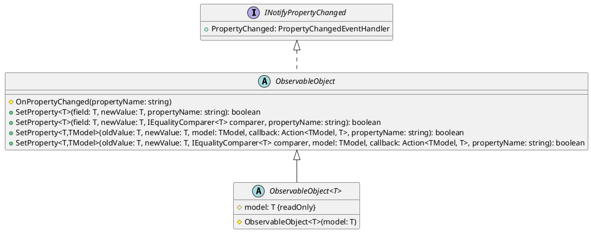
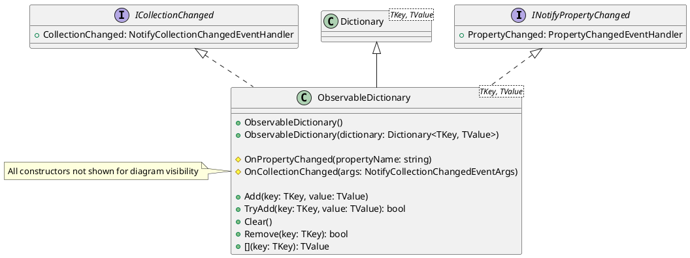
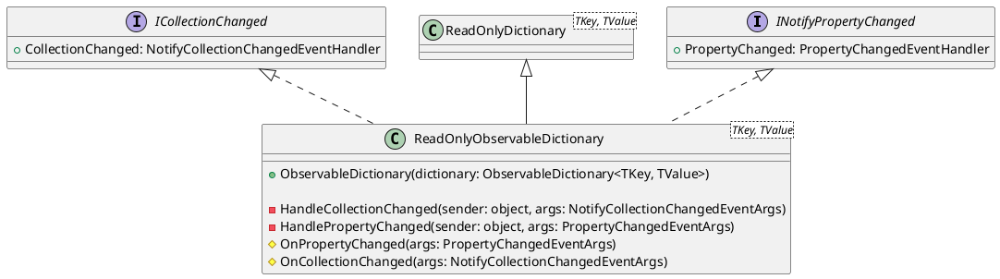
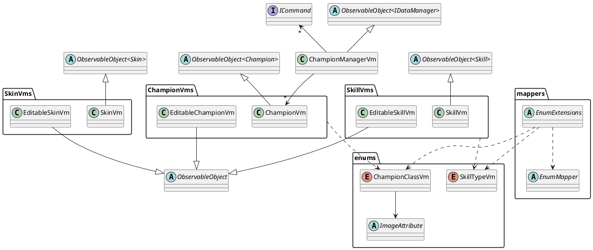
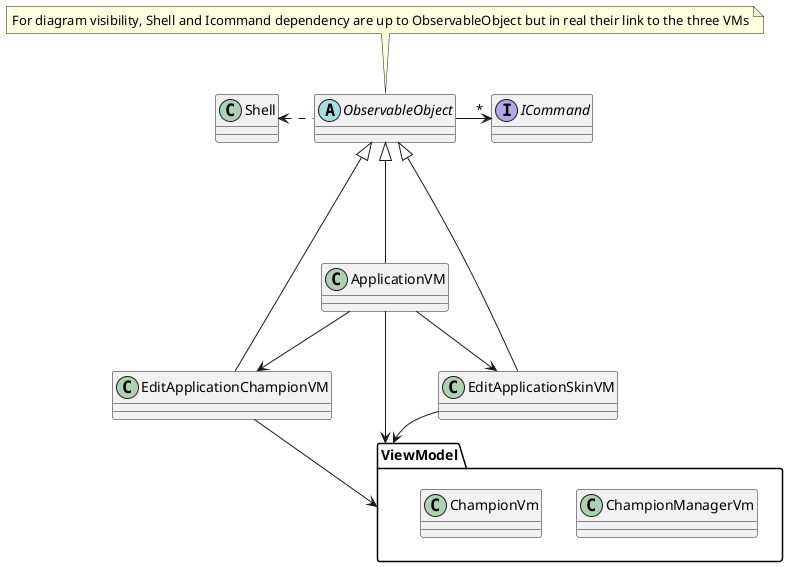

# LoLMVVM

## Overview

 This is a quick application to list the champions of League of Legends. You can Add, Edit and Delete champions. You can also see the details of each champion.

 We have two version of the application:  

- one with a custom MVVM Toolkit
  This version is in the [`main`](https://codefirst.iut.uca.fr/git/samuel.sirven/LoLMVVM/src/branch/main) branch.
  We use a homemade MVVM Toolkit. It's a simple MVVM Toolkit with an ObsevableObject class and a ObservableDictionary class.

- one with the MVVM Community Toolkit
  This version is in the [`mvvm-toolkit`](https://codefirst.iut.uca.fr/git/samuel.sirven/LoLMVVM/src/branch/mvvm-toolkit) branch.
    We use the MVVM Community Toolkit from Microsoft. It's a complete MVVM Toolkit with a lot of features.

## MVVM Architecture

### What is MVVM?

The MVVM (Model-View-ViewModel) architecture pattern allows for the decoupling of the user interface (View) from the business logic (Model). The connection between these two layers is achieved through a third layer: ViewModel. The ViewModel layer encapsulates the fields of the model so that they can be bound and displayed by the view, and provides commands for the view to interact with the ViewModel.

The MVVM achitecture give a clear separation of responsibilities and facilitates unit testing, as the business logic can be tested independently of the user interface. This separation allows for better code organization and maintainability.

### MVVM Architecture in this project

#### Model

The model represents the application's data and implements the business logic. It's important that the Model dosen't know anything about the View or the ViewModel. It's the ViewModel that exposes the Model's data to the View.

#### View

The view is responsible for displaying the user interface and interacting with the user. It can be a window, a page, or a part of the graphical interface. The view is typically declarative and bound to the corresponding view-model's data. It can use markup languages like XAML to describe the structure and behavior of the interface.

#### ViewModel Wrapping

ViewModel wrapping involves encapsulating the model's properties and methods with methods or commands. This view-model is independent of the view and can be reused in other applications because it exposes the model's properties without making any decisions about the user interface.

#### ViewModel Applicative

In contrast to view-model wrapping, view-model applicative is dedicated to a specific application as it enables actions like screen navigation, which is implementation-specific in an application. Like ViewModel Wrapping all methods that need to be bounds we use commands.

#### Data Binding

Data binding allows for automatic synchronization of data between the view and the view-model. This means that when the view-model's data changes, the view is automatically updated, and when the user interacts with the view, the modifications are reflected in the view-model. This reduces code complexity by eliminating the need to manually handle UI updates.

#### Commands

Commands handle user interactions such as button clicks or swipe gestures, and more. The view-model exposes commands that the view can execute when an event occurs. This enables separation of the user interface logic from the business logic.

## MVVM Toolkit

### Homemade MVVM Toolkit

#### ObservableObject

In order for the view to be notified when any of the view-model properties have changed, the view-model must implement the INotifyPropertyChanged interface, which provides an event that the view subscribes to for notifications.

To send the notification, whenever we go through the setter, we need to call OnPropertyChanged and check that the value is actually different to avoid infinite loops. To avoid doing this every time, I created a base class called ObservableObject that implements this interface and provides two generic methods for setting a property and sending notifications.

In the diagram below, you can see that there are two versions of this class: a generic one that holds a model and a non-generic one that defines methods for updating the fields encapsulated by the view-models and sending change notifications. Note that there are two versions of SetProperty because properties that don't have the attribute need to provide a callback on how they should be updated in order to function properly.



#### ObservableDictionary

In the model characteristics are stored in a `Dictionary`. Cause .NET doesn't provide an `ObservableDictionary`, I created one. It's a simple class that inherits from the Dictionary class and implements the `INotifyCollectionChanged` interface and `ICollectionChanged` interface.
In order be sure that all methods that modify the dictionary send the correct notifications, I override all methods by hiding them and calling the base method and then sending the notification.



Of course to keep the encapsulation we also need to create a `ReadOnlyObservableDictionary`.
I norder to do that we need to create a new class that inherits from `ReadOnlyDictionary` and implements `INotifyCollectionChanged` and `ICollectionChanged`.
Then in the constructor we subscribe to the `PropertyChanged` and `CollectionChanged` events of the `Dictionary` and send the notifications when we receive them.



#### ViewModel Wrapping



#### ViewModel Applicative



### MVVM Community Toolkit

The Community Toolkit gives us a lot of features. We will see the most important.

- [ObservableObject](#observableobject-toolkit)
- [ObservableProperty](#observableproperty)
- [RelayCommand](#relaycommand)
- [NotifyCanExecuteChangedFor](#notifycanexecutechangedfor)

#### ObservableObject Toolkit

The ObservableObject class is a base class for observable objects by implementing the INotifyPropertyChanged and INotifyPropertyChanging interfaces. This class can be used as a starting point for any kind of objects that need to support property change notifications.

It provides a set of SetProperty methods that can be used to easily set property values from types that inherit from ObservableObject and automatically trigger the appropriate events.

It exposes the OnPropertyChanged and OnPropertyChanging methods, which can be overridden in derived types to customize how notification events are triggered.

Like the Homemade version the toolkit give to SetProperty for attirbute and not attribute properties.

```cs
public class ChampionVm : ObservableObject
{
    public Champion Model { get; }

    public string Bio
    {
        get => Model.Bio;
        set => SetProperty(Model.Bio, value, Model, (model, bio) => model.Bio = bio);
    }

    public string Name
    {
        get => _name;
        set => SetProperty(ref _name, value);
    }
    private string _name;

    ...
}
```

For now not really different from the homemade version. But the toolkit give us a lot of other features.

#### ObservableProperty

When we have a property with the attribute, the toolkit give us the `ObservableProperty` attribute. It's a simple attribute that we can use to decorate an attribute to automatically generate the property with the `SetProperty` method.

```cs
public partial class ChampionVm : ObservableObject
{
    public Champion Model { get; }

    [ObservableProperty]
    private string _name;

    ...
}
```

> :warning: Notice that we need to use `partial` class to use the decorator.

#### RelayCommand

The `RelayCommand`decorator cann automatically generate a command from a method.
> :warning: Like the `ObservableProperty` we need to use `partial` class to use the decorator.

- Before
  
```cs
  public class ChampionMgrVm : ObservableObject
{
    public ICommand LoadChampionsCommannd { get; }

    public ChampionManagerVm()
    {
        LoadChampionsCommand = new Command(execute: ExecuteLoadChampions);
    }

        private async void ExecuteLoadChampions(ChampionVm championVm)
    {
        ...
    }
}
```

- After

```cs
public partial class ChampionMgrVm : ObservableObject
{
    [RelayCommand]
    private async void LoadChampions(ChampionVm championVm)
    {
        ...
    }
}
```

#### NotifyCanExecuteChangedFor

NotifyCanExecuteChangedFor is a decorator that can be used to automatically call the `NotifyCanExecuteChanged` method of a command when a property changes. This method is used to refresh the state of the `CanExecute` property of the command.

- Before

```cs
(PreviousPageCommand as Command)?.ChangeCanExecute();
(NextPageCommand as Command)?.ChangeCanExecute();
```

- After

```cs
    [NotifyCanExecuteChangedFor(nameof(PreviousPageCommand))]
    [NotifyCanExecuteChangedFor(nameof(NextPageCommand))]
    [ObservableProperty]
    private int index;
```

So when the `index` property change the `CanExecute` property of the `PreviousPageCommand` and `NextPageCommand` will be refreshed.


## Features

### Working Features

- Display a list of champions
- Select a champion to see the details
- Characteristic management (Add, Edit, Delete)
- Class management
- Edit a champion
- Add a champion
- Skills management (Add, Edit, Delete)
- Skins management (Add, Edit, Delete)

### Almost Working Features

- Select a skin to see the details
- Edit a champion
- Edit a Skin
  
In order to see the skin detail we need to swipe left to show the swipe action, and then click on the skin between the two buttons.
It cause by the Border encapsulating the SwipeView.

This two edit features not work really well on iOS due to margin of the Cancel and Save buttons.
